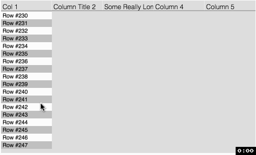

# Canvas Table View

Some experimentation in creating a complex view purely in `<canvas>` (with a single `<input>` for text editing in the future).

## Examples

## Why?
Because I felt constrained in my ability to build abstractions using HTML, CSS, and React. For example having to use CSS classes to get animations and a strict nesting that its requirement of specific element nestings, which introduce noise and distract from the business logic / logical hierarchy.
